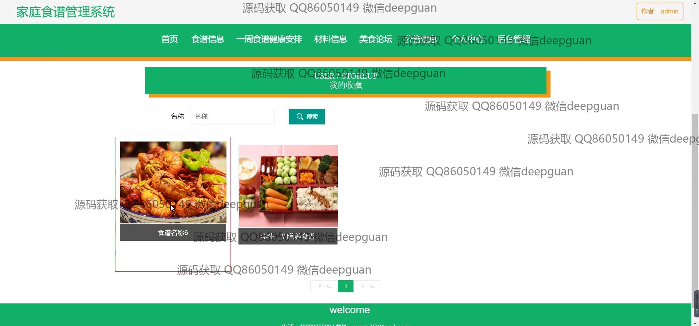
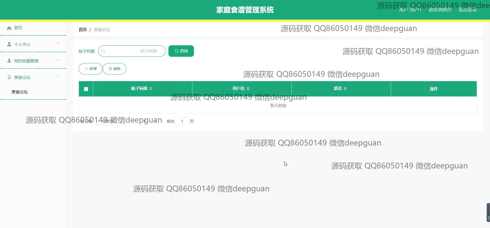

<h1 align="center">的家庭美食食谱网站系统vue</h1>

## 简介
家庭美食食谱管理系统：角色分为管理员、用户；包含登录注册、食谱分类管理、一周健康饮食安排、材料信息管理、美食论坛和公告管理等功能。    --计算机毕业设计源码；毕设源码；java毕业设计源码

## 联系方式

<h3 align="center">获取完整代码与数据库文件 + 微信：deepguan QQ: 86050149 QQ群: 783742310</h3>

<h3 align="center">可帮忙远程部署 包运行成功！提供远程部署、修改代码、设计文档指导、代码讲解等服务！</h3>

## 功能介绍（完整见运行截图）
管理员：提供用户和权限管理功能，支持食谱分类与信息管理，并可进行系统公告发布和管理。具备查看博客帖子管理的权限，包括创建、编辑、删除帖子等功能。拥有对网站全局功能模块如一周食谱健康安排、材料信息管理、美食论坛等的访问和管理权限。可以登录系统后台，进行全面的系统设置与调控。

普通用户：可以通过账号注册和登录后访问系统，浏览和收藏各种食谱信息。通过网站首页与导航栏，可以快速进入食谱分类、材料信息和每周健康食谱安排等模块。用户能在美食论坛中参与帖子创建与互动，分享和讨论美食心得。个人中心提供了信息管理功能，如修改个人资料和查看收藏食谱。

## 运行截图

本代码来源于网络,仅供学习参考使用!

